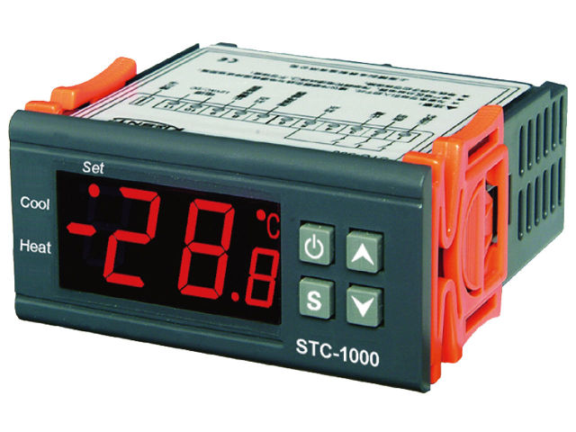
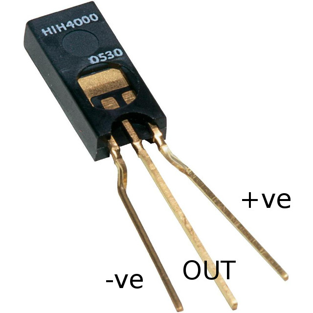

STC\-1000+ humidity controller
==============================

This is a firmware and Arduino based uploader for the STC-1000 dual stage thermostat. The purpose is to control the relative humidity, to avoid conditions where mold and other organic growth can thrive.

Features
--------

* Adjustable limits for humidity over the temperature interval of interest
* Adjustable time period needed for conditions to be above thresold before turning on
* Adjustable minimum on time
* 'On time' counter

The concept is to use a [Honewell HIH 4000-001](http://www.farnell.com/datasheets/1685535.pdf) relative humidity sensor as well as the standard temperature sensor, to monitor the conditions of for example crawl spaces and such and when conditions that exceed the programmed settings are detected for longer than desired are detected, a heater (heating cable) is engaged, slowly raising the temperature and thereby lowering relative humidity, until a safe region is reached again.

Parameters
----------

|Menu item|Description|Values|
|--------|-------|-------|
|r0|Maximum allowed relative humidity at 0°C|0 to 100%|
|r5|Maximum allowed relative humidity at 5°C|0 to 100%|
|r10|Maximum allowed relative humidity at 10°C|0 to 100%|
|r15|Maximum allowed relative humidity at 15°C|0 to 100%|
|r20|Maximum allowed relative humidity at 20°C|0 to 100%|
|r25|Maximum allowed relative humidity at 25°C|0 to 100%|
|r30|Maximum allowed relative humidity at 30°C|0 to 100%|
|r35|Maximum allowed relative humidity at 35°C|0 to 100%|
|r40|Maximum allowed relative humidity at 40°C|0 to 100%|
|r45|Maximum allowed relative humidity at 45°C|0 to 100%|
|r50|Maximum allowed relative humidity at 50°C|0 to 100%|
|don|Minimum number of hours for conditions to exceed limit before engaging heater|0 to 999 hours|
|dff|Minimum number of hours heater is on before turning off (if conditions are ok)|0 to 999 hours|
|tc|Temperature correction|-5.0 to 5°C|
|rhc|Relative humidity correction|-10 to 10%|

The rationale for the *don* parameter is that daily fluctuations may make conditions infavourable for growth, even though it might be above the threshold for some hours during the night.
Similarily, the *dff* parameter is just to ensure, that if the heater is turned on, then it should at least be on long enough that it does some good.

Additional notes
----------------

The implementation samples relative humidity and temperature continuously, but 8 times per hour (that is 7.5 minutes apart), the values are compared to the limits set. The outcome is remembered. Then once an hour, these last eight comparisons are checked (that is the last hours worth). If a heating cycle is ongoing, then 6 (or more) of the 8 samples need to be below threshold (and heater must have been on at least *dff* hours) for heating cycle to end.
If a heating cycle is not ongoing, then 6 (or more) of the 8 samples must be above threshold, or the the heating delay counter *don* is reset to the programmed value. When *don* hours have consecutively been above threshold, the heater is engaged.

The honewell HIH sensor was chosen before sensors such as the DHT22, because it is way simpler to use and just is the right choice for this setup. Even though is is more expensive and I have no experience with the DHT's, I have no doubt that it is worth the extra mulah. 

Connections
-----------

The absolutely easiest way to hook up the HIH 4000-001 is to use the programming header on the STC, which has all the connections needed.

|STC|HIH 4000-001|
|GND|-ve|
|VDD|+ve|
|ICSPCLK|OUT|

Note that a resistor of 80k is also needed between *-ve* and *OUT*.

